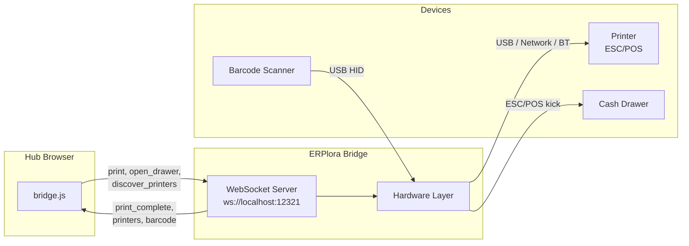
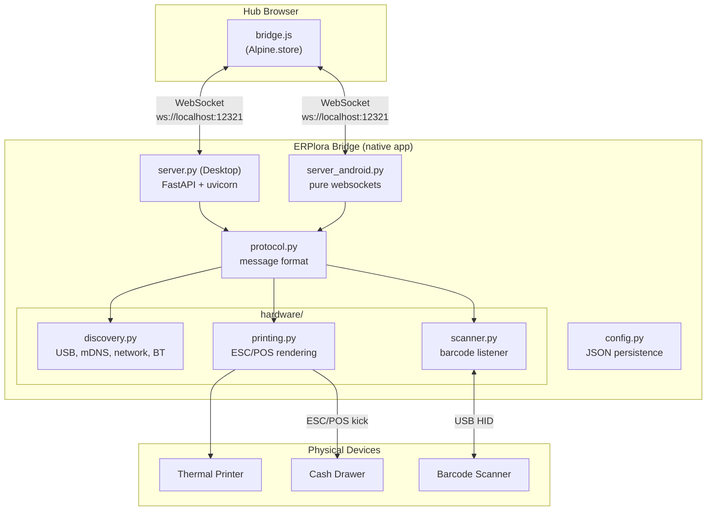
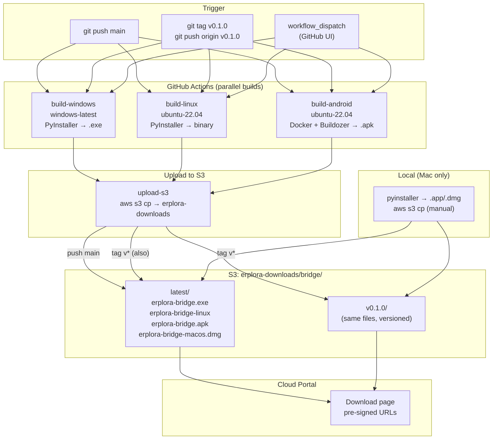

# ERPlora Bridge

Native hardware bridge for ERPlora Hub. Connects the Hub browser with local printers, cash drawers, and barcode scanners via WebSocket.

## Quick Start

```bash
cd native
python3.11 -m venv .venv
source .venv/bin/activate
pip install -e ".[dev]"

# Run the bridge
python -m erplora_bridge

# Or with custom port
python -m erplora_bridge --port 12321
```

The bridge opens a WebSocket server on `ws://127.0.0.1:12321/ws`. The Hub browser auto-detects and connects to it.

## How It Works



1. The bridge runs as a background service (no GUI)
2. The Hub browser detects the bridge via `GET /status`
3. On detection, opens a WebSocket connection
4. All printer discovery, configuration, and printing is controlled from the Hub web UI
5. If the bridge is not detected, the Hub falls back to `window.print()`

## Supported Hardware

| Device | Connection | Library |
|--------|-----------|---------|
| ESC/POS Thermal Printers | USB, Network (port 9100), Bluetooth | python-escpos |
| Cash Drawer | Via printer ESC/POS kick command | python-escpos |
| Barcode Scanner (USB HID) | USB (keyboard mode) | evdev (Linux), IOKit (macOS), ctypes (Windows) |

## WebSocket Protocol

### Commands (Hub → Bridge)

```json
{"action": "get_status"}
{"action": "discover_printers"}
{"action": "print", "printer_id": "usb:0x04b8:0x0202", "document_type": "receipt", "data": {...}, "job_id": "uuid"}
{"action": "open_drawer", "printer_id": "usb:0x04b8:0x0202"}
{"action": "test_print", "printer_id": "usb:0x04b8:0x0202"}
{"action": "send_notification", "title": "Order Ready", "body": "Table 5"}
{"action": "toggle_keyboard", "visible": true}
```

### Events (Bridge → Hub)

```json
{"event": "status", "version": "0.1.0", "printers": [...], "scanner": true}
{"event": "printers", "printers": [{...}]}
{"event": "print_complete", "job_id": "uuid"}
{"event": "print_error", "job_id": "uuid", "error": "Paper out"}
{"event": "barcode", "value": "1234567890123", "type": "EAN13"}
{"event": "keyboard_toggled", "visible": true}
```

## Configuration

Config is stored at:
- **macOS**: `~/Library/Application Support/ERPloraBridge/bridge_config.json`
- **Windows**: `%APPDATA%/ERPloraBridge/bridge_config.json`
- **Linux**: `~/.config/ERPloraBridge/bridge_config.json`
- **Android**: Internal app storage

---

## Building

All builds are done from the `native/` directory. PyInstaller is used for desktop builds (macOS, Windows) and Buildozer + Docker for Android.

### Prerequisites (desktop builds)

```bash
cd native
python3.11 -m venv .venv
source .venv/bin/activate
pip install -e ".[build]"   # Installs PyInstaller + all dependencies
```

> **Important**: PyInstaller can only build for the platform it runs on. macOS builds require a Mac, Windows builds require Windows.

---

### macOS (.app bundle)

Builds a background `.app` bundle (`LSBackgroundOnly`, no Dock icon).

**Prerequisites:**
```bash
brew install libusb   # Required for USB printer support
```

**Build:**
```bash
cd native
source .venv/bin/activate
pyinstaller build/macos/erplora_bridge.spec \
    --distpath dist/macos \
    --workpath build/macos/temp \
    --noconfirm
```

**Output**: `dist/macos/ERPlora Bridge.app` (~18 MB)

**Test the build:**
```bash
# Run the built app
open "dist/macos/ERPlora Bridge.app"

# Check it's running
curl http://127.0.0.1:12321/status

# Stop it
pkill -f erplora-bridge
```

**Spec file**: `build/macos/erplora_bridge.spec`
- `console=False` — no terminal window
- `LSBackgroundOnly=True` — runs as background service
- `LSUIElement=True` — hidden from Dock
- `bundle_identifier=com.erplora.bridge`

---

### Windows (.exe)

Builds a single `.exe` file (no console window).

> **Must be built on a Windows machine** (or via CI with a Windows runner). Cannot cross-compile from macOS.

**Prerequisites (on Windows):**
```powershell
# Install Python 3.11 from python.org
cd native
python -m venv .venv
.venv\Scripts\activate
pip install -e ".[build]"
```

**USB printer support** requires [Zadig](https://zadig.akeo.ie/) to replace the default printer driver with WinUSB.

**Build:**
```powershell
cd native
.venv\Scripts\activate
pyinstaller build\windows\erplora_bridge.spec ^
    --distpath dist\windows ^
    --workpath build\windows\temp ^
    --noconfirm
```

**Output**: `dist\windows\erplora-bridge.exe`

**Spec file**: `build/windows/erplora_bridge.spec`
- `console=False` — no console window
- `upx=True` — compress binaries
- Single-file mode (all dependencies bundled)

---

### Linux (binary)

Builds a single binary file.

**Prerequisites:**
```bash
sudo apt-get install libusb-1.0-0-dev
cd native
python3.11 -m venv .venv
source .venv/bin/activate
pip install -e ".[build]"
```

**Build:**
```bash
cd native
source .venv/bin/activate
pyinstaller build/linux/erplora_bridge.spec \
    --distpath dist/linux \
    --workpath build/linux/temp \
    --noconfirm
```

**Output**: `dist/linux/erplora-bridge`

**Spec file**: `build/linux/erplora_bridge.spec`
- `strip=True` — strip debug symbols for smaller binary
- Single-file mode (all dependencies bundled)

---

### Android (.apk)

The Android build uses Docker with the `kivy/buildozer` image. The bridge uses a pure-websockets server (`server_android.py`) instead of FastAPI/uvicorn since those have C dependencies that are hard to cross-compile.

**Prerequisites:**
- Docker Desktop installed and running
- ~5 GB disk space (SDK + NDK downloaded on first build)

**Build (recommended):**
```bash
cd native
bash build/android/build.sh
```

**Output**: `dist/erplorabridge-0.1.0-arm64-v8a-debug.apk` (~13 MB)

**What `build.sh` does:**
1. Creates a clean `buildozer_workspace/` directory
2. Copies `main.py` (Android entry point) + `erplora_bridge/` package + `buildozer.spec`
3. Runs Docker with `kivy/buildozer:latest` (`--platform linux/amd64` for build-tools compat)
4. Copies the resulting `.apk` to `dist/`

**Build times:**
- First build: 15-30 min (downloads Android SDK 34, NDK r25b, compiles Python + native libs)
- Subsequent builds: 2-5 min (SDK/NDK cached in `buildozer_workspace/.buildozer/`)

**Apple Silicon Macs:**
- Docker runs in `linux/amd64` emulation (Rosetta/QEMU) since Android build-tools (aidl, etc.) are x86_64-only
- This is slower than native x86_64 but works correctly
- The `build.sh` script handles the `--platform linux/amd64` flag automatically

**Manual build (without Docker):**
```bash
# Requires: JDK 17, Android SDK 34, NDK r25b, Cython<3.0
pip install buildozer cython==0.29.36

cd native

# Prepare workspace (buildozer needs main.py at root)
rm -rf buildozer_workspace
mkdir -p buildozer_workspace
cp build/android/main.py buildozer_workspace/
cp -r erplora_bridge buildozer_workspace/
cp build/android/buildozer.spec buildozer_workspace/

cd buildozer_workspace
buildozer android debug
```

**Gotchas:**
- Workspace directory must NOT start with `.` (buildozer skips dot-directories)
- `android.no-byte-compile-python = True` is needed on macOS to avoid hostpython path issues
- The Android version uses `server_android.py` (pure websockets) instead of `server.py` (FastAPI)
- Only ARM64 is built by default (`android.archs = arm64-v8a`)

**Install on device:**
```bash
adb install dist/erplorabridge-0.1.0-arm64-v8a-debug.apk
```

---

## Architecture

### Component overview



### Directory structure

```
native/
├── .github/
│   └── workflows/
│       └── build.yml              # CI: builds Win/Linux/Android → S3
├── erplora_bridge/
│   ├── __init__.py          # Version
│   ├── __main__.py          # CLI entry point (desktop)
│   ├── config.py            # BridgeConfig (JSON persistence)
│   ├── protocol.py          # WebSocket protocol constants & helpers
│   ├── server.py            # FastAPI + WebSocket server (desktop)
│   ├── server_android.py    # Pure websockets server (Android)
│   └── hardware/
│       ├── discovery.py     # USB, mDNS, network, BT printer discovery
│       ├── printing.py      # ESC/POS print rendering
│       └── scanner.py       # Barcode scanner listener
├── build/
│   ├── macos/
│   │   └── erplora_bridge.spec    # PyInstaller spec (macOS .app)
│   ├── windows/
│   │   └── erplora_bridge.spec    # PyInstaller spec (Windows .exe)
│   ├── linux/
│   │   └── erplora_bridge.spec    # PyInstaller spec (Linux binary)
│   └── android/
│       ├── buildozer.spec         # Buildozer config
│       ├── main.py                # Android entry point
│       └── build.sh               # Docker build script
├── dist/                          # Build outputs
│   ├── macos/ERPlora Bridge.app
│   ├── windows/erplora-bridge.exe
│   ├── linux/erplora-bridge
│   └── erplorabridge-*.apk
├── buildozer_workspace/           # Android build workspace (generated)
├── tests/
└── pyproject.toml
```

## Notifications

The bridge supports sending OS-level notifications from the Hub:

| Platform | Method |
|----------|--------|
| macOS | `osascript -e 'display notification'` |
| Windows | PowerShell `New-BurntToastNotification` |
| Linux | `notify-send` |
| Android | Native `NotificationManager` via pyjnius |

Usage from Hub browser console:
```javascript
ERPlora.bridge.sendNotification('Order Ready', 'Table 5 is ready');
```

## CI / CD Pipeline

### Build & Distribution Flow



### How it works

| Platform | Where it builds | How it reaches S3 |
|----------|----------------|-------------------|
| Windows (.exe) | GitHub Actions (`windows-latest`) | Automatic (CI workflow) |
| Linux (binary) | GitHub Actions (`ubuntu-22.04`) | Automatic (CI workflow) |
| Android (.apk) | GitHub Actions (`ubuntu-22.04` + Docker) | Automatic (CI workflow) |
| macOS (.app/.dmg) | **Local Mac** (requires Xcode/signing) | Manual: `aws s3 cp` |

### S3 layout

```
s3://erplora-downloads/bridge/
├── latest/                         ← always points to most recent build
│   ├── erplora-bridge.exe          # Windows
│   ├── erplora-bridge-linux        # Linux
│   ├── erplora-bridge.apk          # Android
│   └── erplora-bridge-macos.dmg    # macOS (manual upload)
└── v0.1.0/                         ← created on tag push
    ├── erplora-bridge.exe
    ├── erplora-bridge-linux
    ├── erplora-bridge.apk
    └── erplora-bridge-macos.dmg
```

### GitHub Actions secrets required

| Secret | Description |
|--------|-------------|
| `AWS_ACCESS_KEY_ID` | IAM user with `s3:PutObject` on `erplora-downloads/bridge/*` |
| `AWS_SECRET_ACCESS_KEY` | Corresponding secret key |

### Creating a versioned release

```bash
# 1. Tag the commit
git tag v0.1.0
git push origin v0.1.0
# → CI builds all 3 platforms → uploads to bridge/v0.1.0/ AND bridge/latest/

# 2. Upload macOS build manually
aws s3 cp dist/macos/erplora-bridge-macos.dmg s3://erplora-downloads/bridge/v0.1.0/erplora-bridge-macos.dmg
aws s3 cp dist/macos/erplora-bridge-macos.dmg s3://erplora-downloads/bridge/latest/erplora-bridge-macos.dmg
```

---

## Virtual Keyboard

The bridge can open/close the OS virtual keyboard for touchscreen POS terminals:

| Platform | Method | Notes |
|----------|--------|-------|
| Windows | `TabTip.exe` (touch keyboard) with `osk.exe` fallback | Best for POS terminals |
| Android | `InputMethodManager` via pyjnius | Works on tablets |
| macOS | Not supported | No touchscreen hardware |
| Linux | `onboard` (GNOME on-screen keyboard) | Requires `onboard` installed |

Usage from Hub browser console:
```javascript
ERPlora.bridge.toggleKeyboard(true);   // Show keyboard
ERPlora.bridge.toggleKeyboard(false);  // Hide keyboard
```

The Settings UI also shows Show/Hide buttons when the bridge is connected.

---

## USB Printer Setup

### macOS
```bash
brew install libusb
```

### Windows
Install [Zadig](https://zadig.akeo.ie/) to replace the printer driver with WinUSB.

### Linux
Add udev rules for printer access:
```bash
echo 'SUBSYSTEM=="usb", ATTR{idVendor}=="04b8", MODE="0666"' | sudo tee /etc/udev/rules.d/99-escpos.rules
sudo udevadm control --reload-rules
```
